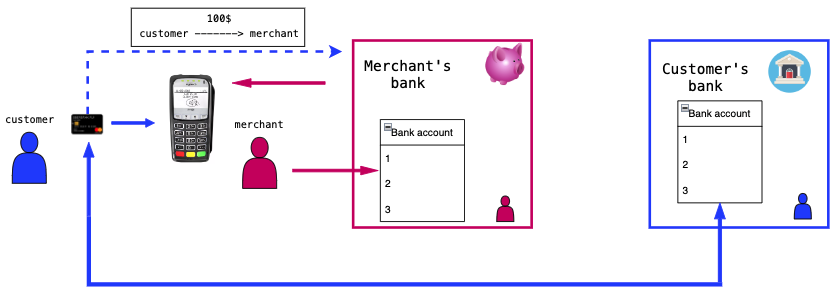

# Банковская система

---

## Банковские переводы

---

В этом курсе будет произведен разбор нескольких блокчейн-платформ с точки зрения архитектуры и математики:

- Bitcoin (биткойн, как исторический пример)
- Ethereum (эфир, как пример хорошей реализации смарт-контрактов)
- Corda (продукт банковского консорциума R3)
- Hyperledger Fabric

Solidity - это язык виртуальной машины эфира, на котором пишутся смарт-контракты для эфира. 
В Corda и Hyperledger можно программировать практически на любом языке. 

Самое главное: 

в программировании распределенного приложения, использующего технологию блокчейн, основные затраты ресурсов приходятся на разработку логики. 

Программирование блокчейна занимает примерно 10%  времени (эта цифра очень сильно зависит от решения). 

Почему блокчейн стал таким популярным?

Ведь до появления блокчейна было очень много способов оплаты (Яндекс-деньги, QIWI-кошелек и другие платежные системы).

Известно, что у блокчейна проблемы с производительностью.

Когда покупатель расплачивается банковской картой, подтверждение платежа происходит через доли секунды. При расчете в криптовалюте подтверждение происходит в течение десятка секунд (например, в эфире 30 секунд). Дело в том, что в эфире подтверждение перевода и сам перевод - это одно действие. В банковском секторе при оплате банковской картой подтверждение происходит через 2-3 секунды, а деньги поступают через 3 дня.

Первую роль, которая обусловила интерес к технологии блокчейн, играет явление, получившее название ***дезинтермедиация***.

**Дезинтермедиация** - устранение посредников из цепочки поставок, или «вырезание посредников».

Как это происходит?

Почему транзакция в эфире происходит быстрее, чем банковская транзакция?

Потому что в банковской транзакции задействовано очень много посредников.

Весь финансовый сектор и экономика финансов говорят, что нужны посредники для решения каких либо задач.

Есть несколько фундаментальных экономических проблем:

- проблема информационной ассиметрии;
- трансформация рисков;
- ликвидности и т.д.

Рассмотрим конкретный пример, что происходит с карточной транзакцией, когда обычный пользователь расплачивается банковской картой с продавцом товара или услуги.

Действующие лица:

клиент, покупатель, заказчик (customer);

продавец (merchant)

Покупатель прикладывает свою карту

 

к терминалу продавца

Общая схема:

Где продавец получил терминал по приему карт?

В банке, в котором обслуживается продавец. Продавец открыл в банке счет. **Юридическое лицо** не может функционировать без открытия счета в банке:

Уже на этом этапе видна разница между открытием счета в банке и созданием счета в биткоине. Счет в биткоине открыть очень просто и быстро. Далее мы рассмотрим разные стартапы, которые направлены на то, чтобы у обычного человека счет (кошелек, wallet) всегда был под рукой. Создать программное решение, которое позволит пользователю создать свой кошелек очень просто (например, в *Telegram*). Запрограммировать приложение, которое позволит в мессенджере открыть банковский счет проблематично.

А где получил банковскую карту покупатель?

В банке, в котором обслуживается покупатель. Покупатель тоже должен открыть счет в банке. К этому счету привязывается банковская карта покупателя:

Далее в этом курсе мы рассмотрим, как работали чеки, потому что все современные платежные системы выросли из чеков.

Итак, покупатель (владелец карты) прикладывает карту к терминалу.

Что делает терминал?

Терминал передает в банк продавца согласие покупателя, формируется транзакция. В транзакции говорится, что покупатель, у которого есть счет в банке (Customer's bank), перечисляет продавцу 100$ за какой то товар или услугу:

В банковской транзакции указывается несколько реквизитов, например, код товара или услуги, MCC-code и т.д.

Банк продавца (Merchant's bank) передает эту транзакцию международной платежной системе или просто платежной системе. Допустим, это VISA:

Предварительно банк продавца заключил договор с платежной системой VISA, открыл счет в системе, внес средства и т.д.

Банк покупателя произвел такие же действия:

Платежная система передает сведения в банк покупателя (Customer's bank):

Банк покупателя видит, что его клиент согласился перевести 100$. 
Банк списывает со счета покупателя 100$. 
Перечисляет эти средства платежной системе (вернее, дает системе подтверждение, что у его клиента-покупателя есть в наличии эти 100$ - а деньги будут переведены позже):

Платежная система дает подтверждение банку продавца:

Банк продавца через терминал передает подтверждение своему клиенту, что деньги есть и продавец видит успешное проведение транзакции:

В общем случае терминал печатает чек:

Печать чека подтверждает, что продавец может отдать товар покупателю.

Так происходит эквайринг (от англ. *acquire* «приобретать, получать»).

Банк получателя называется банк-эквайер, а банк покупателя банк-эмитент. Это самая простая схема:

Обратите внимание, какое число посредников в этой самой простой схеме.

Во-первых, чтобы открыть счет, необходимо обратиться к банку.

Во-вторых, банку для возможности открытия счета необходимо обратиться к Центральному Банку (ЦБ) и получить лицензию (как минимум, заплатить за эту лицензию), внести деньги на резервы:

И только после этого банк вправе открывать счета.

В-третьих, счет вы можете открыть только в банке.

Если участник такой схемы желает оплатить товар или услугу (или перевести средства другому участнику), то он должен пройти все эти этапы (запрос и получение подтверждения) и только потом начинается процесс ***клиринга***.

Существующая банковская инфраструктура достаточно громоздкая. Этот процесс взят как образец с западной финансовой системы. 

Мы разобрали случай, в котором банки разные. Если банк получателя и отправителя один, то схема и процесс значительно упрощаются. Счета участников находятся в одном банке. В этом случае перевод средств происходит внутри этого банка между счетами получателя и отправителя:

Посредников в данном случае очень мало, поэтому процесс перевода происходит очень быстро.

Если перевод осуществляется из одного банка в другой, то начинаются сложности. В этом случае у банка есть несколько способов: 
- осуществить межбанковский перевод;
- осуществить несрочный перевод.

Существует так называемая платежная система банка Росси (ПСБР). А ЦБ - это псевдоним этой системы. В ПСБР есть две категории платежей:
- срочный, система электронных срочных платежей (БЭСП);
- не срочный (зависит от того, в каком регионе находятся банки).

У банков А и Б есть корреспондентский счет в Центральном Банке. Банк А отправляет в течение определенного времени (по регламенту) какие то платежи в банк Б. Платежи могут быть разного характера. Банк России выполняет роль клирингового центра (Clearing House). 

Если платеж срочный, то платеж просто переводится с одного счета на другой и средства начисляются на счет получателя (применяется многоступенчатый протокол: передача-подтверждение на каждом этапе процесса). Для обработки процессов на каждой стороне можно поставить мощные серверы для масштабирования. Это называется Real Time Gross Settlement (RTGS).

Если платеж несрочный (большинство платежей физических лиц), то начинается сложная процедура неттинга.

***Неттинг*** – это взаимозачет торговых операций (финансовых требований) и их итоговое сальдирование.

Суть неттинга заключается в том, что если, например, банк А захочет перевести в банк Б 1000000 (миллион) платежей, то этому банку необязательно все эти платежи постоянно переводить. Банк А может подождать, пока банк Б тоже захочет перевести в банк А 500000 платежей. Эти платежи банки сравнят, посмотрят взаимоисключающие обязательства и Банк России оптимизирует движение капиталов и переводит только чистые позиции по корсчетам. Затем Банк России уведомляет банки о переводе средств:

---

## Blockchain

---

> Но пришла технология блокчейна и всю эту громоздкую систему банковских переводов «уничтожила»...

Как же эти процессы (транзакции) происходят в блокчейне?

В основе всего находится обычная база данных со счетом, владельцем которой является пользователь:

Как решить проблему недоверия в данном случае? 

Появился один главный человек, который взял на себя роль «Вождя», создал базу данных и объявил о своей собственной валюте. 

Что нужно добавить в эту схему?

Мы будем собирать блокчейн по клеточкам. Пока **ВОЖДЬ** только сказал, что у него есть база данных с аккаунтом admin:

Первое условие: база данных должна быть у всех, кто присоединится к ВОЖДЮ.

Присодинился второй участник к ВОЖДЮ с такой же базой данных:

Проходит некоторое время и второй участник заявляет, что ему надоела власть ВОЖДЯ и тоже требует права админа:

Какие элементы необходимо в эту схему добавить?

Нам нужно, чтобы эти две базы между собой синхронизировались:

Давайте вспомним Владимира Ильича Ленина:

> Коммунизм - это Советская влась плюс электрификация всей страны

Блокчейн - это:

> Блокчейн = BD (база данных) + Sync (синхронизация)

ВОЖДЬ поменял базу данных и эта база перезаписалсь у Невождя, при этом просходит процесс логгирования. Создается какой то лог, в которых видны изменения, с которыми Невождь не согласен:

> Блокчейн = BD + Sync + log

Юридически произошла сделка, в которой Невождь отдал ВОЖДЮ (пока он еще вождь) какой то товар, ВОЖДЬ перевел за товар свою тысячу красивых криптобус, а через час перевел все обратно. 

Как избежать этой ситуации? Судиться? 

Мы опять получаем посредника в роли источника истины.

Как сделать так, чтобы в этой базе данных человек мог отправлят средства только с того счета, которым владеет? 

Здесь на помощь приходит ***Подпись***:

> Блокчейн = BD + Sync + log + Подпись

Действительно, в блокчейне это решается цифровой подписью.

Что происходило до появления в формуле Подписи?

Создавалась транзакция по переводу средств. А затем создавалась другая транзакция, изменяющая предыдущую транзакцию.

Мы поверили первой транзакции и должны поверить второй, потому что мы решили для себя верить всему, что находится в этой базе данных. 

Теперь давайте откажемся от этой веры и будем верить всему (каждой записи в этой базе данных), но только если транзакция подписана владельцем счета, которого касается запись.

### **Электронная цифровая подпись**

Несколько слов о криптографии.

В общем случае мы располагаем неким математическим алгоритмом, который позволяет нам сгенерировать два связанных числа А и В:

Эти числа связаны между собой какой то особенной математической формулой (функцией):

Эти числа можно рассчитать вручную на обычном листе бумаги.

Обычный человек по этому алгоритму может рассчитать для себя два числа, связанных между собой:

> Число В называется **«открытый ключ»**, число А называется **«закрытый ключ»**:

Закрытый и открытый - это просто названия. С точки зрения математики - это два совершенно эквивалентных числа.

Мы можем запросто поменять эти числа местами.

Разница состоит в том, что открытый ключ мы размещаем в сети, где его может увидеть каждый. А закрытый ключ мы храним в своем пространстве, куда никому нет доступа:

Человек (наш контрагент), которому мы хотим передать секретное зашифрованное сообщение, делает то же самое:

Формулы у этих участников могут быть одинаковыми. 

> Главное: каждый должен знать ***свою*** функцию

У нас есть открытая сеть и участник А хочет передать участнику В произвольное сообщение, например: «В, привет!»:

Для этого участник А берет свое сообщение, берет открытый ключ B' участника В (своего контрагента) и подает их на вход в некий шифратор Scr:

Алгоритм выдаст на выход шифратора абсолютно нечитаемый набор символов (с точки зрения статистического анализа этот набор символов невозможно соотнести с фразой «В, привет!»):

В этом наборе количество символов не совпадает с количеством в исходном тексте сообщения. Например, частота гласных и согласных неодинакова.

Это сообщение участник А может свободно передать участнику В по открытой сети:

Любой, кто увидит это сообщение, не сможет его расшифровать, потому что для расшифровки нужно использовать парный ключ  ***B' <---> A'***.

А этот ключ никто не знает, кроме самого контрагента В.

Этот контрагент получает сообщение и подает это сообщение совместно со своим закрытым ключом A' на алгоритм дешифрации Dec и на выходе получает сообщение «В, привет!»:

> Так работает ***Ассиметричная криптография***

В симметричной криптографии используется один и тот же ключ для шифрования и дешифрования.

Симметричная криптография - это очень просто и примитивно. Допустим, у нас есть какой то двоичный код, какое то случайное число, которое мы сгенерировали в качестве пароля:

А это наше сообщение в бинарном представлении:

Для того, чтобы сообщение зашифровать, применяем функцию XOR (исключающее ИЛИ):

Таблица истинности для этой функции:

|a|b|a ^ b|
|:---:|:---:|:---:|
|0|0|0|
|0|1|1|
|1|0|1|
|1|1|0|

В результате кодирования мы получаем сообщение:

Это сообщение (1110011011) мы отправляем контрагенту, контрагент применяет функцию XOR с тем же самым паролем, который мы применили для шифрования исходного сообщения и расшифровывает принятое сообщение:

Так работает симметричная криптография. В технологии блокчейна такая криптография неприменима.

Как работает шифратор? Зачем мы вообще начали его рассматривать? Мы же про подпись говорим?

Дело в том, что на базе этого механизма у шифратора есть особенные свойства.

Допустим, мы его встретим завтра и спросим, что он от нас получил. А контрагент ответит: «В, привет!», то мы знаем, что личность В и открытый ключ B' однозначно связаны между собой:

И на этом этапе уже можно догадаться, как создается ***цифровая подпись***.

В нашем случае пары ключей ***А <---> B*** и ***A' <---> B'*** неважно как называть, потому что один позволяет что то зашифровать, а другой расшифровать и наоборот. 

На этом и основан принцип применения цифровой подписи.

Когда контрагент А получил этот шифр на выходе шифратора:

он подписывает это сообщение своей цифровой подписью.

Каким образом? 

Очень просто.

Контрагент А снова подает это сообщение на вход щифратора, но уже совместно со своим закрытым ключом и получает новое сообщение (например: **?!Xo**):

Затем сообщение **#?1a** и сообщение **?!Xo** собирается в один пакет и отправляется контрагенту В.

